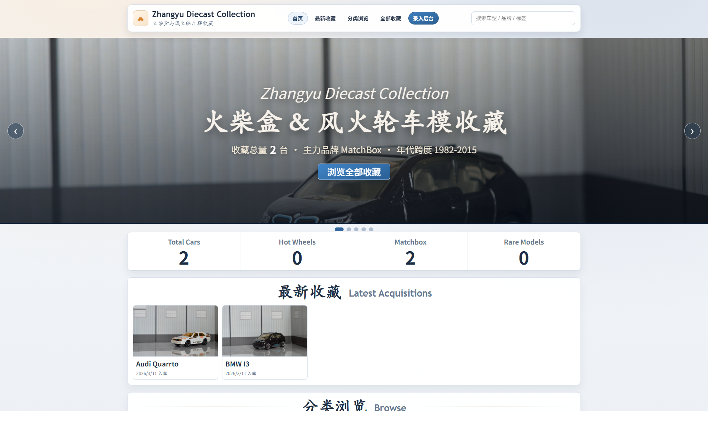
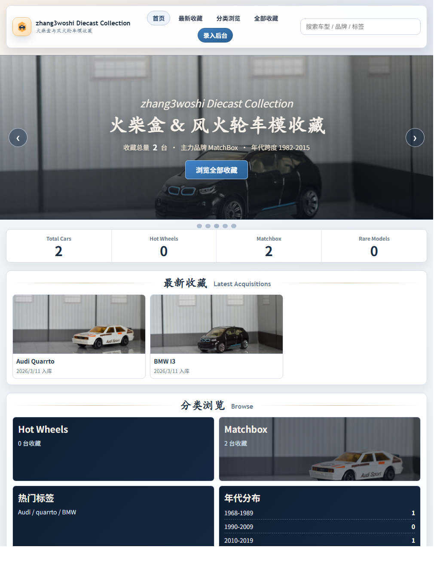
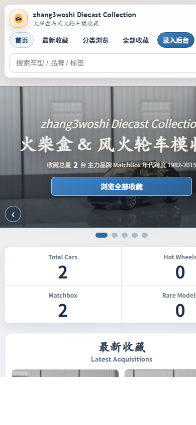

# BigToy Garage（中文说明）

English version: [README.md](./README.md)

BigToy 是一个合金车模展示站点 + 管理后台项目。

## 首页截图

### 桌面端



### 平板端



### 手机端



## 技术栈

- 后端：Go + Beego v2
- 前端：Vite + Vue 3
- 数据库：SQLite（`backend/data/models.db`）
- 图片存储：`backend/data/images/<model-id>/`

## 核心功能

- 前台展示页（`/index.html`）
- 模型详情页（`/model.html`）
- 管理页（`/admin.html`，需要登录）
- 模型增删改（仅管理员）

## 本地运行

### 后端

```powershell
cd backend
go mod tidy
go run main.go
```

默认地址：`http://localhost:11000`

### 前端开发模式

```powershell
cd frontend
npm.cmd install
npm.cmd run dev
```

默认地址：`http://localhost:5173`

## 测试与覆盖率

### 后端（Go）

```powershell
cd backend
go test ./...
powershell -ExecutionPolicy Bypass -File .\check-coverage.ps1
```

### 前端（Vite + Vitest）

```powershell
cd frontend
npm.cmd run test
npm.cmd run test:coverage
```

## 数据路径

- SQLite 数据库：`backend/data/models.db`
- 图片根目录：`backend/data/images`
- 对外图片访问路径：`/uploads/<id>/<file>`

## API

- `GET /api/models`
- `POST /api/models`（需登录）
- `PUT /api/models/:id`（需登录）
- `DELETE /api/models/:id`（需登录）
- `POST /api/auth/login`
- `POST /api/auth/logout`
- `GET /api/auth/me`

## 其他部署与运维说明

系统服务安装、HTTPS 生产部署、自动备份、GitHub Release 自动化等高级说明，请参考英文文档：[README.md](./README.md)。
